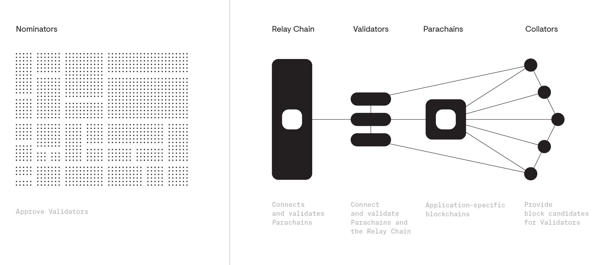
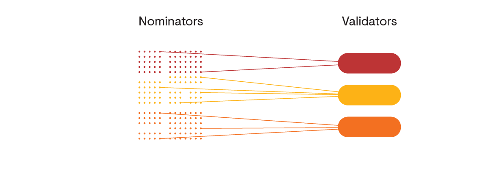
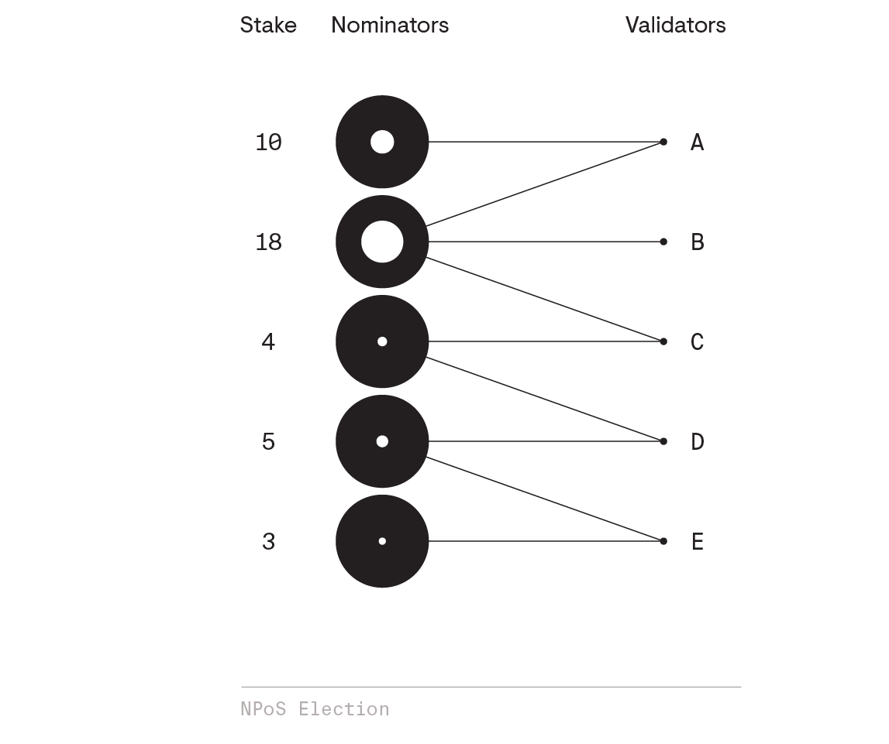
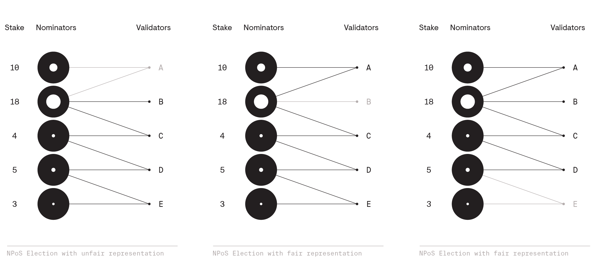
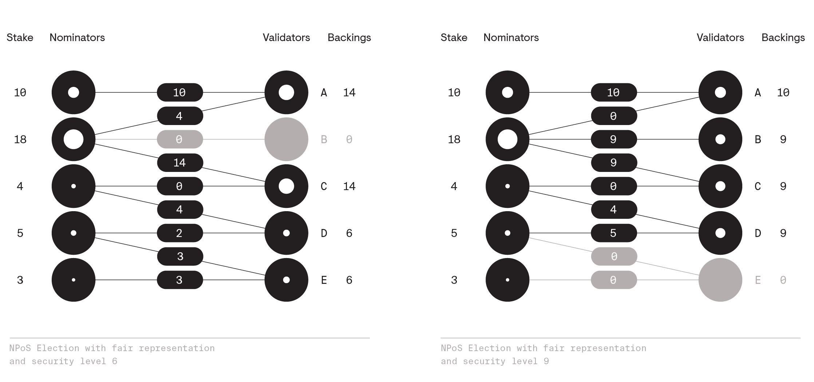

====================================================================

**Owners**: [Alfonso Cevallos](/research_team_members/alfonso.html)

====================================================================

The Polkadot blockchain will implement nominated proof-of-stake (NPoS), a relatively new type of scheme used to select the validators who are allowed to participate in the consensus protocol. In this note we give an intro to NPoS, and a peek inside the research carried out at the Web3 Foundation. We also explain the peculiar way in which validators get elected. So how does NPoS work in Polkadot?

## Validators and nominators

A couple of times per day, the system elects a group of entities called **validators**, who in the next few hours will play a key role in highly sensitive protocols such as block production and the GRANDPA finality gadget. Their job is demanding as they need to run costly operations, ensure high communication responsiveness, and build a long-term reputation of reliability. They also must stake their DOTs, Polkadot’s native token, as a guarantee of good behavior, and this stake gets slashed whenever they deviate from their protocol. In contrast, they get paid well when they play by the rules. Any node that is up to the task can publicly offer itself as a validator candidate. However, for operational reasons only a limited number of validators can be elected, expected to be hundreds or thousands.

The system also encourages any DOT holder to participate as a **nominator**. A nominator publishes a list of validator candidates that she trusts, and puts down an amount of DOTs at stake to support them with. If some of these candidates are elected as validators, she shares with them the payments, or the sanctions, on a per-staked-DOT basis. Unlike validators, an unlimited number of parties can participate as nominators. As long as a nominator is diligent in her choice and only supports validator candidates with good security practices, her role carries low risk and provides a continuous source of revenue. There are other special roles in the Polkadot network, but we focus only on the relation between these two roles.

## The NPoS scheme

This nominator-validator arrangement gives strong security guarantees. It allows for the system to select validators with massive amounts of aggregate stake — much higher than any single party’s DOT holdings — and eliminate candidates with low stake. In fact, at any given moment we expect there to be a considerable fraction of all the DOTs supply be staked in NPoS. This makes it very difficult for an adversarial entity to get validators elected (as they need to build a fair amount of reputation to get the required backing) and very costly to attack the system (because any attack will result in large amounts of DOTs being slashed).

Our NPoS scheme is much more efficient than proof-of-work (PoW) and faster than standard proof-of-stake (PoS). Networks with deterministic finality must have a limited validator set (the size can be changed with governance). NPoS allows for virtually all DOT holders to continuously participate, thus maintaining high levels of security by putting more value at stake and allowing more people to earn a yield based on their holdings.

## The election process

How to elect the validators, given the nominators’ votes? Unlike other PoS-based projects where validators are weighted by stake, Polkadot gives elected validators equal voting power in the consensus protocol. To reflect this fact, the nominators’ stake should be distributed among the elected validators as evenly as possible, while still respecting the nominators’ preferences. At the Web3 Foundation research team, we use tools ranging from election theory to game theory to discrete optimization, to develop an efficient election process that offers fair representation and security, and can be applied in the future to any blockchain using NPoS. We explore these objectives below, together with some examples.

**Fair representation.** In the late 19th century, Swedish mathematician Lars Edvard Phragmén proposed a method for electing members to his country’s parliament. He noticed that the election methods at the time tended to give all the seats to the most popular political party; in contrast, his new method ensured that the number of seats assigned to each party were proportional to the votes given to them, so it gave more representation to minorities. The property achieved by his method is formally known as proportional justified representation, and is very fitting for the NPoS election because it ensures that any pool of nodes is neither over-represented nor under-represented by the elected validators, proportional to their stake. Our heuristics build on top of Phragmén’s suggested method and ensure this property in every election.

The illustration represents a typical input to the election process, with nominators on the left having different amounts of stake, and connected by lines to those validator candidates on the right that they trust (for simplicity, validators have no stake of their own in this example, though they will in a real scenario). Suppose we need to elect k = 4 validators. The fair representation property roughly translates to the rule that any nominator holding at least one k-th of the total stake is guaranteed to have at least one of their trusted validators elected. As the total stake is 40 DOTS and a fourth of it is 10 DOTS, the first two nominators are guaranteed to be represented by a validator. In the image below we see three possible election results: one that violates the fair representation property and two that achieve it.

**Security.** If a nominator gets two or more of its trusted validators elected, we need to distribute her stake among them, in such a way that the validators’ backings are as balanced as possible. Recall that we want to make it as difficult as possible for an adversarial pool to get a validator elected, and they can achieve this only if they get a high enough backing. Therefore, we equate the level of security of an election result to *the minimum amount of backing of any elected validator*. For the last two election results with fair representation, we provide stake distributions which show that they achieve security levels of 6 and 9 respectively.

The election result on the right achieves a higher security level, and clearly does a better job at splitting the nominators’ stake into validators’ backings of roughly equal size. The goal of the NPoS election process is thus to provide a result that achieves fair representation and a security level that is as high as possible. This gives rise to a rather challenging optimization problem (it is [NP-complete](https://www.britannica.com/science/NP-complete-problem)), for which we have developed fast approximate heuristics with strong guarantees on security and scalability.

We are excited about the technical developments brought forward by Polkadot, and the possibilities enabled by NPoS and other highly efficient schemes being developed in the blockchain space. To learn more about Nominated Proof-of-Stake, visit our [Wiki pages](https://wiki.polkadot.network/docs/en/learn-staking), and read our [research paper](2. Paper.md).
