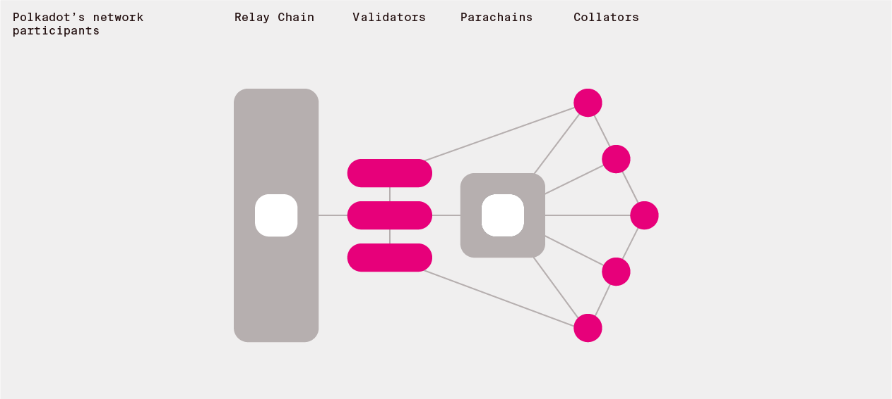
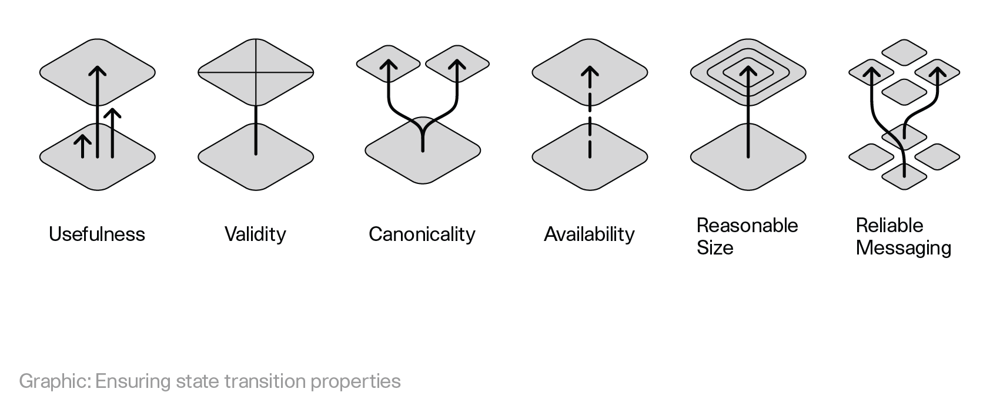

# Polkadot

*DRAFT*

This article summarizes the research efforts relevant to the Polkadot project, for other information regarding the project please refer to the [wiki page](https://github.com/w3f/Web3-wiki/wiki/Polkadot).

Polkadot speaking in abstract terms provides a number of connected canonical state machines. Connected means that a state transition of one machine can affect a transition of another machine. The state machines are canonical, since they transition in a globally consistent manner. We would also like to enable adding, removing and changing of the state machines as the time goes on. This will be the role of the governance process.

The research focuses on how to enable having such publicly available system in the face of possible adversarial conditions. The public can use the system by interacting with state machines that they are interested in via the internet. Each state machine can provide different functionalities and behave in different ways (have a different state and state transition scheme).

So let us start with abstract state machines. A state machine has a certain state type and state transition type. As the time goes on, state transitions occur.

The data that determines the state transitions is structured as bundles of transactions - individual small state transitions triggered by the users of the system. Each bundle is called a block. In order to achieve its properties, ensures that those blocks are hash connected forming joint data structure.

## 1. Specification of the Polkadot Runtime Environment

We are working on a implementation level specification of the protocol [here](https://github.com/w3f/polkadot-re-spec).

## 2. Identifying participants to run the network

### 2.1 Keys

To identify unique individual participants that will perform duties on the network we use public key cryptography. You can read more about our approach [here](https://github.com/w3f/research/tree/master/polkadot/keys) and see the particular crypto for the first implementation in the [Schnorrkel repo](https://github.com/w3f/schnorrkel).

Validator keys indicated by the staking key are:
* transport layer: ed25519
* GRANDPA and consolidated reporting: BLS
* block production (VRF): Ristretto

### 2.2 Proof-of-Stake

In order to keep certain parties accountable for ensuring various properties listed below we make sure to be able to punish these participants by taking away some of their funds (Proof-of-Stake). The primary nodes running the network are the validators. To ensure a large set of participants is able to contribute to the security of the network we introduce a Nominated Proof of Stake scheme (NPoS). This scheme allows participants which do not wish to run nodes to be able to help with the validator selection. The current method used to distribute that stake is the [Sequential Phragmén Method](NPoS/phragmen.md).

For Polkadot use Phragmén's method as a fallback, but allow for better solutions to be submitted. As an edge case, if no good solution is submitted, run the slow heuristic which provides a 2-approximation (TODO: publish).

Judging NPoS solutions:

- Check if a submitted solution is locally optimal in the sense of a certain local search procedure. Locally optimal solutions have a fairness property. Thus we only accept solutions that are fair (TODO: publish).
- Among the submissions that observe the first property about fairness, select the one that maximizes the minimum stake of any selected validator. This ensures maximum security threshold for each parachain validator group.

A comprehensive list of misbehaviours that have to be penalized can be found in the [sanctioning sheet](https://docs.google.com/spreadsheets/d/1HSCiAf9pyxUSwojGQzg_pestlS_8yupCOTGnIGSvp9Q/edit?usp=sharing).

### 2.3 Why not use different sets for different tasks?

Use the same validator set for BABE as for GRANDPA as to avoid paying more in total for block production + finality.

## 3. Ensuring state transition properties

### 3.1 Usefulness

Each state transition should bring some utility to the system participants. In order to ensure that this is the case:

- state machines should be useful to participants
- state transitions processed by these state machines reflect well the state transition needs of participants.

To ensure that the state machines are useful we should ensure that there is a mechansim that enables participants to decide what state machines should be included and how they should change to reflect participant needs. This mechanism is the [Polkadot governance scheme](https://github.com/paritytech/polkadot/wiki/Governance).

To ensure that useful state transitions are processed by those state machines, we will want to ensure that useful transactions get included in Polkadot blocks. Polkadot will have a transaction fee mechanism on the relay chain to ensure that transactions issued by parties willing to pay a reasonable price for them are included. There will also be a certain portion of each block that is dedicated to certain high-priority transactions, such as misbehaviour reporting. The usefulness of the parachain state transitions has to be ensured by the state transition function of a given chain.

### 3.2 Validity

The notion of validity in Polkadot is determined by a state transition validation function (STVF). Each chain in the ecosystem has to have one implemented. In order for all nodes to be able to run this function it is being distributed as deterministic WebAssembly (Wasm) code which can be executed by the Polkadot Runtime Environment.

The blocks are produced by parachain collators, then they get validated using the STVF by the subset of validators responsible for the given parachain to finally get included in the Polkadot Relay Chain. During this process validators, parachain collators and other parties are free to challenge claims of validity to trigger additional check, these parties are referred to as fishermen. [Read here about parachain validity](validity.md).

### 3.3 Canonicality

Canonicality of the Polkadot network state machines is achieved via a combination of a block production mechanism with eventual probabilistic canonicality (BABE scheme) and [GRANDPA finality gadget](https://github.com/w3f/consensus/blob/master/pdf/grandpa.pdf). This approach allows for block production (thus transaction confirmations) to be fast, while allowing for as fast as possible economic finality with compact proofs.

### 3.4 Availability

In order for the critical data from all chains to remain reachable by users and subsequent block producers, Polkadot makes use of an erasure coding based [availability scheme](availability.md).

## 4. Ensuring reliable messaging between state machines

Besides ensuring all the above properties for all parachain, a crucial element of Polkadot is that these state machines are able to affect each others state transitions. This is done via the [Inter-Chain Message Passing (ICMP) scheme](ICMP.md).

## 5. Keeping resource usage under control

### 5.1 Reasonable size

To ensure that the state transitions can be processed and stored by the network their size has to be reasonable. Mechanisms such as transaction fees and block limits are there to limit the storage size and computation required for each block.

### 5.2 Light client

The protocol is being designed with light client support in mind with existing Substrate implementation supporting one.

## 6. Desired qualities

- Minimal: Polkadot should have as little functionality as possible.
- Simple: No additional complexity should be present in the base protocol.
- General: Polkadot can be optimized through making the model into which extensions fit as abstract as possible.
- Robust: Polkadot should provide a fundamentally stable base-layer.
